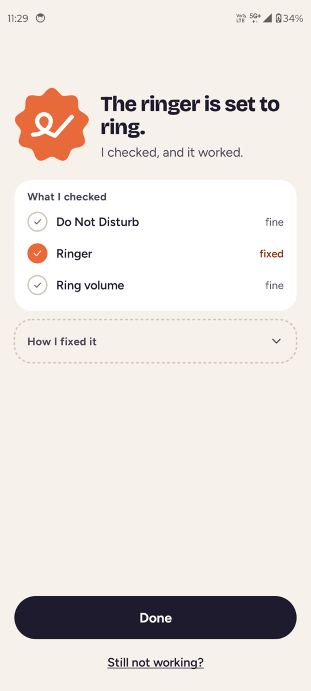
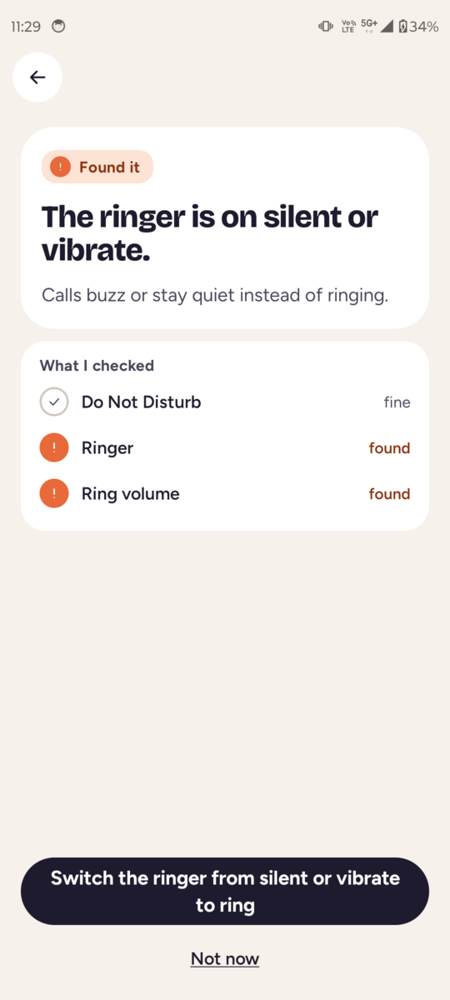
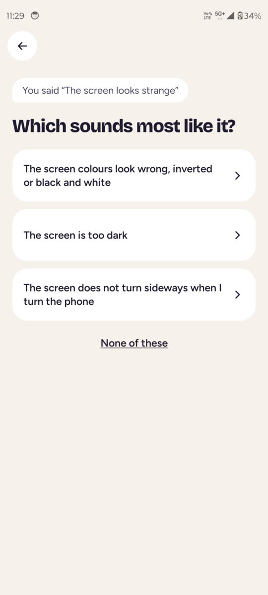
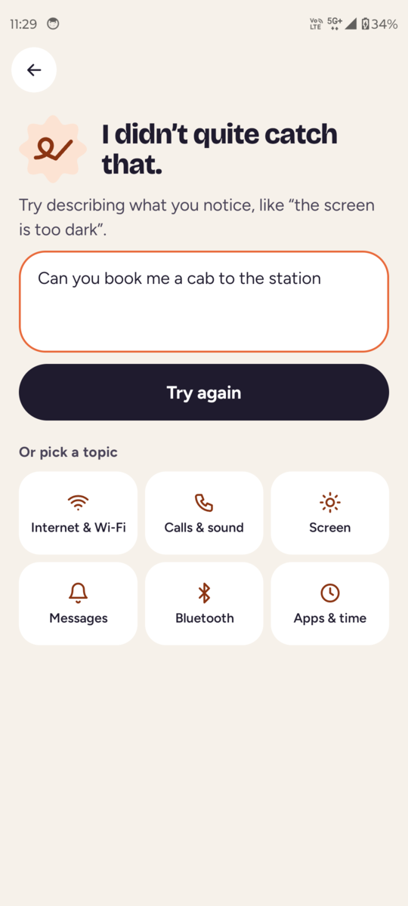

# Unstuk

An offline Android app that fixes a non-technical user's phone from a plain complaint ("phone doesn't ring", "phone
is talking to me"). A 35 MB on-device decision model reads the complaint and the phone's state and picks one fix
from a fixed catalog. Deterministic code then performs the fix and checks that it worked. The model decides; code
acts.

https://github.com/user-attachments/assets/602edbc6-e0a0-4e1c-9cd4-244e2fa8eeb2

- **89.3%** of in-scope complaints mapped to the right problem on a frozen, LLM-written test set, against 73.9% for
  the best baseline. A fix runs by itself for the wrong problem on 3.0% of lines, and calibration error is 3.6%.
- **9.6 ms** per decision on a Moto Edge 30, with an int8 bge-small graph through ONNX Runtime. The release APK
  is 70.8 MB, and the app has no `INTERNET` permission.
- **0 false successes** in every on-device run: no fix is reported until a fresh read of the phone confirms it.

Real users' messages (M8) are still to come; the model ships only if it beats the baselines on them too.

**Try it:** a signed preview APK for Android 10+ is on the [Releases](https://github.com/rishikeshvk/unstuk/releases)
page. On Android 13+, a sideloaded app's accessibility service is blocked at first ("Restricted setting"); from
0.1.1 the app's access screen walks you through allowing it. By hand: try to turn Unstuk on under Accessibility
once, then open App info → ⋮ → Allow restricted settings and turn it on again.

In India and other regions where Google Play Protect runs [enhanced fraud
protection](https://developers.google.com/android/play-protect/warning-dev-guidance), installing the APK from a
browser, messaging app or file manager is blocked ("App blocked to protect your device"), because Unstuk uses an
accessibility service. Installing from a computer works: `adb install unstuk-0.1.1-preview.apk`.

**Read the write-up: [docs/writeup.md](docs/writeup.md).** It covers the size waterfall, calibration, the baseline
comparison and where the model fails.

- Plan and philosophy: [docs/plan.md](docs/plan.md)
- Milestones: `docs/mN-spec.md`, `docs/mN-results.md` and a plain-words `docs/mN-summary.md` for M1 to M9
- Code: `android/` (Kotlin, Compose, the accessibility executor), `ml/` (Python: data, baselines, training,
  export), `catalog/` (the problems, fixes and risk tiers both sides read)

**Release builds** are signed with a key kept outside the repo. Set `unstuk.release.storeFile`, `storePassword`,
`keyAlias` and `keyPassword` in `~/.gradle/gradle.properties`, then run `./gradlew assembleRelease` in `android/`.
Without them the release build fails, and debug builds are unaffected. Before sharing an APK, run
`android/scripts/release-smoke.sh` with a phone attached: it installs the release build and checks launch, the
model and one fix on each automated rung.
