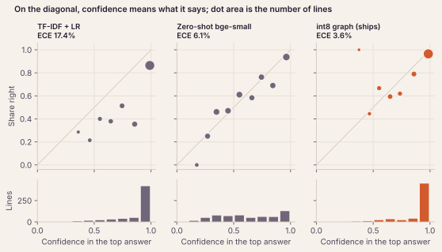
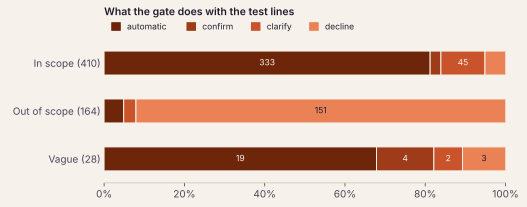
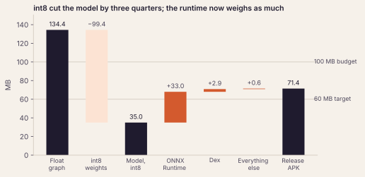

# Unstuk: a 35 MB decision model that fixes phones offline

2026-10-08 · Rishikesh V K · The project's write-up (M9). The plan is [plan.md](plan.md); each milestone has a spec
and a results doc beside it.

<p>


</p>

*Four replies on a Moto Edge 30, from left: a fix run and checked, a fix that asks first, a question, and a
decline. The complaints are fixtures, typed by `android/scripts/screenshots.sh`.*

## The problem

People who aren't comfortable with phones describe symptoms, not settings. "Phone doesn't ring" can mean Do Not
Disturb, a silent ringer or a ring volume of zero. "Phone is talking to me" means TalkBack. The fix is usually one
switch, but finding it means knowing the setting's name and where this phone's maker put it.

Unstuk takes the complaint as typed and fixes the phone. Its rule is **the model decides; code acts**. A small
on-device model reads the complaint and the phone's state, and picks one problem from a fixed catalog of 15. From
there, ordinary code does the rest: it diagnoses which cause holds, applies the fix and reads the phone again
before it says anything worked. The model never produces text that gets run or shown. Its only output is a choice
among options it was given, with a probability.

Two constraints shaped everything else:

- **Offline.** Someone whose internet is broken is exactly who needs help, so the app has no `INTERNET`
  permission at all. ONNX Runtime's library manifest asked for it, and until the first signed build it was
  merged in unnoticed. The app's manifest now removes it, and the build fails if any variant's merged manifest
  asks for it again.
- **Calibrated.** The model's probability decides whether the app acts alone, asks first, asks a question or
  declines. A model that is 99% sure and wrong would change a setting the user never asked about, so the
  confidence has to mean what it says.

## How it works

```text
complaint + device-state text
        │
        ▼
int8 bge-small (33M params, ONNX Runtime) ─► complaint vector + "out of scope?" logit
option vectors for the 15 problems, computed at export ┘
        │  Choice: cosine × scale ÷ T → softmax      Noul: sigmoid(logit ÷ T)
        ▼
risk gate ── out of scope, or top < 0.70 ──────────► decline, or "which do you mean?"
        ├── low-risk fix, top ≥ 0.75 ───────────────► run it
        ├── low-risk fix, 0.70–0.75, or medium risk ─► ask first
        └── high risk ──────────────────────────────► step-by-step guide only
        ▼
diagnose → executor ladder: direct API → Settings panel → accessibility tap → guide
        ▼
read the phone again → report
```

**The model** follows the contract of Jev, a hosted "System One" model that answers typed questions (*Choice*,
*Noul*, *Score*) about a state with calibrated probabilities. Its open replica, NanoJev, puts decision heads on a
0.6B LLM. Unstuk does the same on `bge-small-en-v1.5`, a 33M-parameter sentence encoder, so it fits on a phone.

- **Choice** encodes the complaint and each problem's one-line description ("The phone does not ring when someone
  calls") with the same encoder, and scores them by cosine. A new problem is new option text, not a new output
  layer.
- **Noul** ("is this out of scope?") is a sigmoid head reading the complaint alone.
- **Calibration:** fine-tuning adds a Brier term to cross-entropy, and temperatures are fitted on dev.

**The executor** is the hard part, and it was built first (M1). Android lets a normal app change few settings
directly, so each fix climbs a ladder, skipping rungs it doesn't have:

1. A direct API, where one exists: brightness, the ringer.
2. A Settings panel the user taps: Wi-Fi, automatic time.
3. Accessibility automation, where the app taps the switch in Quick Settings or Settings: airplane mode,
   TalkBack.
4. Guided steps.

Each phone maker's switch labels live in data files, not code. Nothing reports success until a fresh read of the
phone agrees. In every on-device run so far, that rule has held with zero false successes: 40 formal trials in M1,
20 scripted complaints in M2 and 17 in M7.

## The data, and why the test is a proxy

| Set | Lines | Written by |
| --- | --- | --- |
| Train | 5,833 | Fresh Claude agents, one persona per batch (age, comfort with phones, English variety, typos); out-of-scope batches; contrast pairs; a slice of Google's Mobile Actions |
| Dev | 1,095 | Nine whole batches held out from the same pool |
| **Test, frozen** | **602**: 410 in scope, 164 out of scope, 28 vague | ChatGPT, Gemini and a Claude with no project context |

The test set was written and locked before any training line existed, by model families that wrote no training
data. It deliberately includes typos, Indian English, negation ("calls ring fine, but…"), long stories, and
collisions such as "my ring finger hurts". Three of the 15 problems never appear in training, so the test can
measure whether a new problem works from its description alone. More on how that turned out below.

It is still a **proxy**. Real people's messages couldn't be collected while the model was being built, so every
number on this page is on LLM-written complaints. M8 is the check on real messages: participants type complaints
for symptom cards, and the model ships only if it still beats the baselines there (see
[Real messages](#real-messages-pending)).

## Baselines and the bar

The neural model had to earn its place. Before it was trained, M4 scored cheap baselines on the frozen test. No
single baseline won everywhere, so each metric got its own bar, set by whichever baseline did best on it.


| Decider | In-scope accuracy | Confident and wrong | Out-of-scope recall | Held-out intents | ECE |
| --- | --- | --- | --- | --- | --- |
| Keyword matcher (M2) | 40.2% | 8.7% | 81.1% | 35.0%¹ | 22.6% |
| TF-IDF + logistic regression | 64.9% | **1.9%** | **95.1%** | 6.2%² | 17.4% |
| Frozen bge-small + logistic regression | 70.0% | 3.8% | 93.3% | 3.8%² | 12.3% |
| Zero-shot bge-small | 73.9% | 3.8% | 33.5% | **93.8%** | 6.1% |
| Fine-tuned + linear head (M5) | 75.4% | 5.2% | 93.9% | 5.0%² | 10.2% |
| Decision model (M5) | 87.1% | 2.6% | 92.1% | 63.7% | 2.8% |
| Calibrated, float (M6) | **89.5%** | 3.0% | 91.5% | 76.2% | **2.6%** |
| **Calibrated, int8 (ships)** | 89.3% | 3.0% | 92.1% | 77.5% | 3.6% |

¹ Hand-written rules, not zero-shot. ² Fixed-head models have no output for a held-out intent; these are lines with
a second, trained problem. The two M5 rows are from [m5-results.md](m5-results.md); their checkpoints are gone, so
they aren't in the figure.

"Confident and wrong" is the safety number. It counts the clear lines where the gate would have run a fix by
itself for the wrong problem.

On the frozen test, the int8 graph passes five of the six rows by paired bootstrap. It beats zero-shot's accuracy
by 10.5 to 20.6 points and its macro-F1 by 17.6 to 24.0. It is not worse than TF-IDF's confident-and-wrong rate
(−0.5 to +2.5) or its out-of-scope recall (−7.1 to +0.7, at the edge), and not worse than zero-shot's
calibration. It **fails held-out intents**: 77.5% against zero-shot's 93.8%. This check was run for this write-up
from the cached scores and decides nothing. On real messages, the M8 rule reports the held-out row without gating
on it.

Two things the ladder shows:

- **Reading option texts beats one output per problem.** The same encoder fine-tuned with a linear head got 75.4%.
  Choosing among descriptions got 87.1%, with half the confident mistakes.
- **TF-IDF is a strong baseline for safety.** Character n-grams make it robust to typos, and it is rarely sure.
  The neural model matches its safety only within the interval.

## Calibration and the gate



A calibrated model is right 80% of the time when it says 80%. TF-IDF sits well under the diagonal (17.4% ECE).
Zero-shot tracks it but is rarely sure. The shipped graph puts most lines above 0.9 and is right on them at about
that rate (3.6% ECE). Two things got it there: a Brier term in the loss and temperature scaling on dev (0.84 for
Choice, 1.49 for Noul).

Calibration only matters through the lines that act on it. They were tuned on dev in M6. **Automatic at 0.75** is
the lowest line at which the automatic picks on dev were wrong at most 2% of the time. **Clarify below 0.70**
catches the most vague dev lines while asking about at most 8% of clear ones.



| Lines | Automatic | Confirm | Clarify | Decline |
| --- | --- | --- | --- | --- |
| in scope (410) | 333 | 11 | 45 | 21 |
| out of scope (164) | 8 | 0 | 5 | 151 |
| vague (28) | 19 | 4 | 2 | 3 |

The sharp model leaves the confirm band thin: 0.70 to 0.75. A low-risk fix is mostly either run or asked about,
and a medium-risk fix always confirms. M6's clearest lesson was that **the lines did more than the loss**.
Training on 135 vague lines didn't make the model ask more about the test's vague lines (17.9%). M5's model under
the tuned lines would have asked about 35.7%.

## On the phone



| Measure (Moto Edge 30, Android 14) | Value |
| --- | --- |
| Model, int8 (every MatMul and Gather in 8 bits) | 35.0 MB, from 134.4 MB in float |
| Release APK | 70.8 MB: model 35.0, ONNX Runtime 33.0, dex 2.2 |
| Model load | 375 ms, in the background at launch |
| One decision | 9.6 ms median, 18.0 ms at the 95th percentile |
| Same top answer as Python, all 1,144 dev lines | 1,144 |

int8 cost nothing measurable. On the test, it is within its interval of float on every row, at a quarter of the
size. The APK is inside the 100 MB budget but over the 60 MB target, and the reason is now the runtime, not the
model: ONNX Runtime's library weighs as much as the model. A reduced-operator build is the next lever.

Getting parity took a correction worth telling. The first int8 check passed on the laptop. Then the phone
disagreed with Python on 8 dev lines, by up to 0.48 in probability. There were two causes:

1. **Batching.** Dynamic int8 scales activations by the whole batch, padding included. A line's answer therefore
   depended on the 63 lines scored beside it, and the phone scores one line at a time. Scored the app's way, the
   graph that had passed at 99.39% agreement fell to 98.78%, under the 99% bar.
2. **The CPU.** The laptop's x86 chip (AVX2, no VNNI) computes uint8 × int8 products with an instruction that can
   saturate; the phone's ARM chip doesn't. With uint8 weights (U8U8), both compute exactly, and the phone then
   gave Python's top answer on every dev line.

The general lesson: **score the graph the way the app runs it, on the CPU it runs on.** Only a line-by-line
comparison on the phone caught either problem.

## Where it fails

The int8 graph gets 57 of the 574 clear test lines wrong. Each mistake was given one cause from a list fixed before
any of them was read ([M9 spec](m9-spec.md), section 4). The codes are in
[`data/failures/test-int8.jsonl`](../data/failures/test-int8.jsonl).


- **Held-out intents (18).** These are the zero-shot gap from the ladder. 9 of the 18 are declined as out of
  scope: "the date at the top says 2019 and my bank site says something about a certificate" is declined at 1.00.
  The out-of-scope check learned that anything unfamiliar is off-topic, and a never-trained problem is unfamiliar.
- **The words point to another setting (14),** and the model follows them. "Calls ring normally, but my WhatsApp
  texts come silently" is named `phone_not_ringing` at 0.99. An alarm "ringing" is read as the ringer, and
  TalkBack's "green square" as a colour problem. Five of these run by themselves, the largest share of the 17
  confident mistakes.
- **Typos and odd wording (12):** "the lighting on the glass", "the writing is completely microscopic", "nobdy can
  rch me it doesnt snd". Most are declined or asked about, not run, which is the gate doing its job.
- **Collisions (7):** a shirt's colours, a watch's time, an "internet friend". Four of them run by themselves at
  0.84 to 0.97, because the topic word matches and nothing else outweighs it.
- **The phone's state, or the label, would settle it (6).** "Pages refuse to open" is no internet or Wi-Fi
  that won't load, depending on what the phone shows. And whether unwanted rotation is out of scope or the
  rotation problem is debatable: the same switch fixes both.

Two splits stand out:

- **Writers.** Gemini wrote 255 of the clear test lines and 40 of the 57 mistakes: 84.3% right, against 94.6% for
  ChatGPT's lines and 94.8% for the context-free Claude's. Gemini's paraphrases reach for unusual words ("the glass",
  "the backlight"), and fresh Claude agents wrote all the training data. The writer gap is the strongest
  argument for M8's real messages.
- **Declines.** 21 of the 44 in-scope mistakes are declines, not wrong fixes. A wrongly declined complaint costs
  the user a retry. A wrong automatic fix changes a setting they didn't ask about, and there are 17 of those.

The tie-break rules used where two causes fit (held-out first, then a debatable label, then collision before
lexical pull, then wording) were settled while coding, not beforehand. They're in the codes' README.

## What didn't work

- **New problems from a description alone.** The plan said a new issue "works zero-shot at first". Seven
  pre-registered rounds in M5 found that fine-tuning keeps the encoder's ability to *name* a new problem (77–83% on
  dev against zero-shot's 83.5%). What breaks is every out-of-scope check tried, which declines a fifth or more of
  a new problem's lines as unfamiliar. A new problem now ships with a few dozen training lines.
- **An out-of-scope gate fitted out of fold** (M6), on models that really hadn't seen some problems. It narrowed
  the wrongful declines but missed its guard on every model, so Noul stayed, as the stop rule said.
- **Teaching the model to be unsure** (M6). Training on vague lines didn't help with the test's vague lines; moving
  the gate's lines did.
- **Re-tuning the gate on the int8 model** (M7). On the dev set, the tuning moved the automatic line on
  about three lines, and confident-and-wrong rose on the test. The app kept M6's lines.

Every one of these was decided by a rule written before the result was seen. That is the habit the project relied
on most: specs fix the comparison, the stop rule and the bar first, and the results docs record every test scoring,
including the ones later superseded.

## Real messages: pending

M8 replaces the proxy with real complaints. Participants are given symptom cards ("Your daughter says she called
you three times this morning…") and type what they'd ask, on their own phones. They also describe a few problems
they really had. The rules are fixed before any message exists:

- **Volume:** at least 150 clear lines from at least 4 people.
- **Labels:** the messages are labelled blind and frozen.
- **Ship rule:** the int8 graph must pass every row of the bar except held-out intents, and still pass with any
  one participant left out.

The messages stay on the developer's laptop. They are never committed, trained on or read by Claude, and they are
deleted once this section is written. The tools are built and tested on a dry run. This section will hold the
aggregate results from `ml/reports/real.md` when the sittings are done.

## What's next

- **Size:** a reduced-operator ONNX Runtime build, or LiteRT, to bring the APK under 60 MB.
- **The executor:** more phone makers (only the Moto is fully tested), and Android 17's Advanced Protection,
  which blocks accessibility services for apps not flagged as accessibility tools. Unstuk isn't one and doesn't
  claim to be, so on those phones it falls back to Settings panels and guides.
- **New problems:** few-shot training lines per new intent, since description-only doesn't hold.
- **v2:** voice through Android's on-device recognizer, and Hinglish.

## Reproducing the figures

```sh
cd ml
uv run unstuk-writeup-scores   # re-score each frozen decider; refuses unless it matches its results doc
uv run unstuk-figures          # draws docs/figures/*.svg
ANDROID_SERIAL=<serial> ../android/scripts/screenshots.sh   # the four screens, on a phone with the debug build
```

The figure code checks the re-scored numbers against the published ones before drawing anything, so a figure can't
silently disagree with a table.
